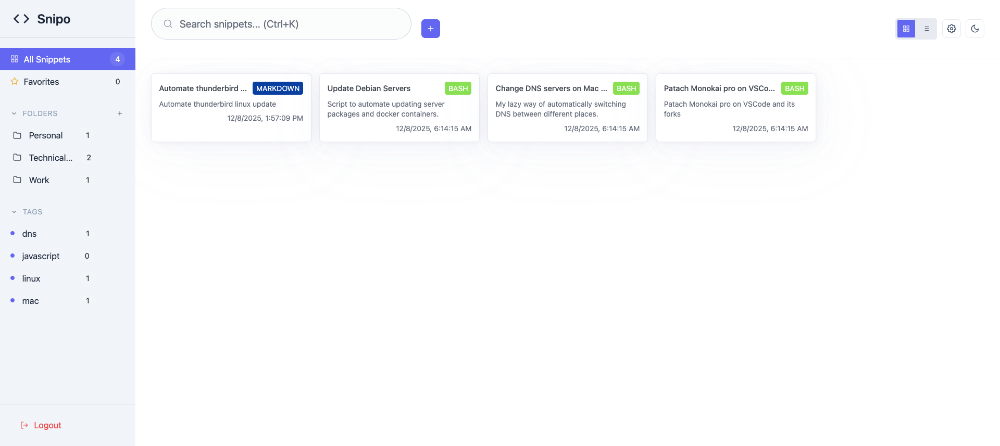

# Snipo

Snipo is a lightweight, self-hosted snippet manager for a single user.

> Snipo does not provide user accounts or tenant isolation. One master password
> protects the instance.

[](https://github.com/MohamedElashri/snipo/actions/workflows/snipo-ci.yml)
[](https://github.com/MohamedElashri/snipo/actions/workflows/snippy-ci.yml)
[](https://github.com/MohamedElashri/snipo/actions/workflows/release.yml)
[](LICENSE)

<p align="center">
  
</p>

## Highlights

- Multi-file snippets with syntax highlighting, folders, tags, search, and history
- Public links, soft deletion, expiration, and encrypted backup export
- Read, write, and admin API tokens
- Optional S3 backups and two-way GitHub Gist sync
- Browser extension and terminal client
- Local frontend assets with no runtime CDN dependency

## Quick start

Create a `.env` file from the example, replace every placeholder, and start the
container:

```bash
cp .env.example .env
chmod 600 .env
docker compose up -d
```

Snipo listens on <http://localhost:8080>. Continue with the
[deployment guide](docs/deployment.md) before making the instance remotely
accessible.

## Clients

- [Snippy terminal client](tui/README.md)
- [Chrome and Firefox extension](extension/README.md)

## Documentation

- [Deployment and configuration](docs/deployment.md)
- [Security model and controls](SECURITY.md)
- [Feature guide](docs/features.md)
- [CSS customization](docs/customization.md)
- [Development and contribution guide](docs/Development.md)
- [OpenAPI specification](docs/openapi.yaml)
- [Changelog](docs/CHANGELOG.md)

## License

Snipo is licensed under the [GNU Affero General Public License v3.0](LICENSE).
