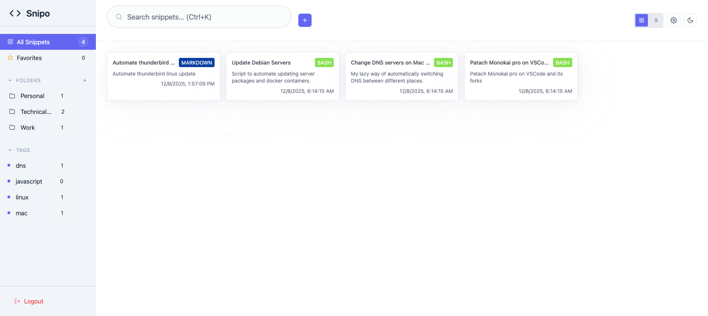

# Snipo

<p align="center">
  
</p>

<p align="center">
  <strong>A lightweight, self-hosted snippet manager for single users.</strong><br>
  <em>Secure your code snippets, organize them seamlessly, and access them from anywhere.</em>
</p>

<p align="center">
  <a href="https://github.com/MohamedElashri/snipo/actions/workflows/snipo-ci.yml"></a>
  <a href="https://github.com/MohamedElashri/snipo/actions/workflows/snippy-ci.yml"></a>
  <a href="https://github.com/MohamedElashri/snipo/actions/workflows/vscode-ci.yml"></a>
  <a href="https://github.com/MohamedElashri/snipo/actions/workflows/extension-ci.yml"></a>
  <a href="https://github.com/MohamedElashri/snipo/actions/workflows/unified-release.yml"></a>
  <a href="LICENSE"></a>
</p>

---

## 📖 What is Snipo?

**Snipo** is a self-hosted snippet management ecosystem built for developers who want complete control over their data. It is designed specifically for a single user, avoiding the complexity of tenant isolation and user accounts in favor of simplicity and strong security.

Whether you're in the terminal, IDE, or browser, Snipo ensures your code fragments, commands, and notes are always at your fingertips.

> **Note**: Snipo is designed for a single user. One master password protects the entire instance. No user management overhead!


## 🚀 Quick Start

Getting started with Snipo via Docker is incredibly easy.

1. **Clone the repository**:
   ```bash
   git clone https://github.com/MohamedElashri/snipo.git
   cd snipo
   ```

2. **Configure your environment**:
   Create a `.env` file from the provided example and fill in the necessary placeholders (like your master password).
   ```bash
   cp .env.example .env
   chmod 600 .env
   ```

3. **Start the instance**:
   ```bash
   docker compose up -d
   ```

Snipo will now be running on `http://localhost:8080`. 

> **Important**: Before exposing Snipo to the internet, please read the [Deployment Guide](docs/deployment.md) for production recommendations!

## 🧩 The Snipo Ecosystem

Snipo extends far beyond a web interface. Check out the dedicated clients:

| Client | Description | Link |
|--------|-------------|------|
| **Snippy** | Fast TUI (Terminal User Interface) client | [View TUI](tui/README.md) |
| **VS Code** | Editor extension for seamless workflow | [View Extension](vscode-extension/README.md) |
| **Browser** | Chrome & Firefox companion extension | [View Browser Ext](extension/README.md) |

## 📚 Documentation

Dive deeper into configuring, securing, and developing Snipo:

- ⚙️ [Deployment & Configuration](docs/deployment.md)
- 🛡️ [Security Model & Controls](SECURITY.md)
- 💡 [Feature Guide](docs/features.md)
- 🖌️ [CSS Customization](docs/customization.md)
- 🛠️ [Development & Contribution Guide](docs/Development.md)
- 📜 [OpenAPI Specification](docs/openapi.yaml)
- 📝 [Changelog](docs/CHANGELOG.md)

## ⚖️ License

Snipo is open-source software licensed under the [GNU Affero General Public License v3.0](LICENSE).
